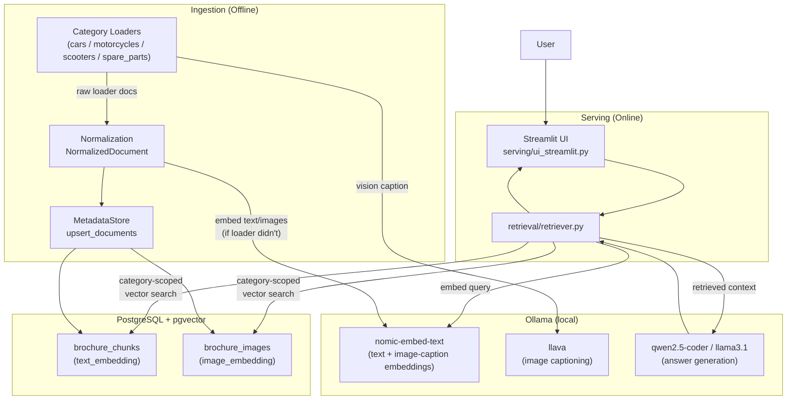

# Tata Automotive RAG

**Multimodal Automotive Knowledge Retrieval System**

A retrieval-augmented generation (RAG) platform that ingests automotive knowledge from heterogeneous sources (dynamic web pages, product images) into one canonical document model, indexes it in PostgreSQL + pgvector, and serves category-scoped, grounded answers through a local LLM (Ollama).

**Author:** **Santhi Bhogavalli** — AI Engineer | GenAI & RAG | Senior DevOps

---

## Table of Contents

1. [Status Legend](#status-legend)
2. [Overview](#overview)
3. [Feature Status](#feature-status)
4. [Architecture](#architecture)
5. [Offline vs. Online Architecture](#offline-vs-online-architecture)
6. [Repository Structure](#repository-structure)
7. [Ingestion Pipeline](#ingestion-pipeline)
8. [Loaders](#loaders)
9. [Multimodal Processing](#multimodal-processing)
10. [Canonical Document Model](#canonical-document-model)
11. [Storage Schema](#storage-schema)
12. [Retrieval Architecture](#retrieval-architecture)
13. [Tech Stack](#tech-stack)
14. [Getting Started](#getting-started)
15. [Configuration Reference](#configuration-reference)
16. [Example Prompts](#example-prompts)
17. [Running Tests](#running-tests)
18. [Roadmap](#roadmap)
19. [Design Decisions and Trade-offs](#design-decisions-and-trade-offs)
20. [Author](#author)

---

## Status Legend

| Marker | Meaning |
|---|---|
| ✅ **Implemented** | Present in the repository and functional |
| 🚧 **In Progress** | Partially implemented or being hardened |
| 🗺️ **Planned** | Architectural target, not yet implemented |

This README describes both the current implementation and the intended "production-grade" direction. Sections and tables label each capability explicitly so planned work is never presented as shipped.

---

## Overview

Automotive product knowledge is scattered across formats: JavaScript-rendered model pages, spec tables, pricing, and product imagery. The system is organized around a source-agnostic pipeline:

```
Category Loader (Playwright)
      ↓
Raw loader document (per-category shape)
      ↓
Normalization → NormalizedDocument (one shape for every category)
      ↓
Embedding (text + image, only what the loader didn't already produce)
      ↓
PostgreSQL + pgvector  (brochure_chunks, brochure_images)
      ↓
Category-scoped retrieval
      ↓
Ollama (grounded answer, falls back to a source list on timeout)
```

Four catalogue categories are ingested today: **cars**, **motorcycles**, **scooters**, **spare_parts**. Each loader discovers its own product pages; everything downstream of normalization is category-agnostic.

---

## Feature Status

| Capability | Status | Notes |
|---|---|---|
| Category loaders (cars, motorcycles, scooters, spare parts) | ✅ Implemented | `ingestion/loader/`; `cars_loader.py` has bespoke discovery, the other three share `GenericVehicleLoader` / `BaseLoader` |
| Dynamic web scraping via Playwright | ✅ Implemented | One browser lifecycle per ingestion run (`BaseLoader.download_and_extract`) |
| Image download, vision captioning, image embeddings | ✅ Implemented | `Embedder.describe_image`/`embed_image`; re-encodes AVIF/WebP to JPEG before sending to Ollama |
| Canonical document model | ✅ Implemented | `ingestion/normalization/document_normalizer.py` (`NormalizedDocument`) |
| Chunking | ✅ Implemented | One product → one chunk (`MetadataStore.upsert_documents`) |
| PostgreSQL + pgvector persistence | ✅ Implemented | `ingestion/metadata/metadata_store.py` |
| Category-scoped retrieval | ✅ Implemented | `retrieval/retriever.py::search_in_category` — never mixes categories; see [Retrieval Architecture](#retrieval-architecture) |
| Streamlit UI | ✅ Implemented | `serving/ui_streamlit.py` |
| Grounded generation via Ollama, with a non-LLM fallback | ✅ Implemented | Falls back to a formatted product list if Ollama times out |
| Metadata-aware filtering (brand / category / model) | ✅ Implemented | Category filter is a SQL `WHERE category = ANY(...)`; brand/model come back in each row's metadata |
| Question-driven category detection ("All" categories selected) | ✅ Implemented | Keyword match (`CATEGORY_TERMS`), falling back to the top match's own category |
| Image vector search at query time | ✅ Implemented | `search_images_for_query`, same category scoping as text |
| HNSW vector indexes | ✅ Implemented | `MetadataStore._ensure_indexes`; falls back to exact scan on pgvector < 0.5 |
| Containerized ingestion | ✅ Implemented | `Dockerfile` (Chromium + Playwright deps baked in) |
| Query understanding beyond category keywords (intent, entities) | 🗺️ Planned | Category detection is keyword-based, not a classifier |
| Keyword search (BM25) + score fusion (RRF) | 🗺️ Planned | Not currently implemented |
| Cross-encoder reranking | 🗺️ Planned | Not currently implemented |
| Scheduled / incremental re-ingestion | 🗺️ Planned | Ingestion is a manual `python -m ingestion.pipeline` run |
| Evaluation harness (retrieval and answer quality) | 🗺️ Planned | `tests/evaluation.py` is a 2-case smoke script, not a harness |
| CI/CD | 🗺️ Planned | No pipeline configured |

---

## Architecture



---

## Offline vs. Online Architecture

The system separates the **data plane** (ingestion) from the **serving plane** (query answering); they share only the database.

### Offline / Data Plane

```
CategoryLoader.download_and_extract()  →  normalize_document()  →  Embedder (text/image)  →  MetadataStore.upsert_documents()
```

Run on demand via `python -m ingestion.pipeline`. It is I/O-heavy (Playwright, image downloads) and compute-heavy (vision captioning on Ollama).

### Online / Serving Plane

```
Streamlit  →  retriever.search_in_category()  →  pgvector nearest-neighbour  →  Ollama (or fallback)  →  Answer + sources
```

Runs per request and is latency-sensitive: each text query makes at most one Ollama embedding call and one Ollama generation call (35s timeout each).

### Why they are decoupled

- **Latency isolation:** scraping and vision captioning take seconds to minutes per product; none of that sits in the Streamlit request path.
- **Independent failure domains:** a blocked loader or a slow website doesn't affect answer serving.
- **Reproducibility:** `brochure_chunks`/`brochure_images` are the contract between the two planes — the knowledge store can be rebuilt (`--reset`) without touching retrieval code.

---

## Repository Structure

```
tata-automotive-rag/
├── Dockerfile
├── pyproject.toml / uv.lock
├── main.py                          # launches the Streamlit app
├── src/
│   ├── config/
│   │   ├── logger.py                 # setup_logger(): one timestamped stdout handler per name
│   │   └── settings.py               # .env loading, DB_PARAMS, EMBEDDING_DIM, VECTOR_OPERATOR
│   ├── ingestion/
│   │   ├── pipeline.py               # orchestrates: load → normalize → embed-if-missing → upsert
│   │   ├── loader/
│   │   │   ├── base_loader.py        # shared crawl pipeline, Ollama/image helpers, dedupe
│   │   │   ├── generic_loader.py     # GenericVehicleLoader: discovery + extraction shared by 3 categories
│   │   │   ├── cars_loader.py        # CarsLoader: bespoke discovery for tata.cars
│   │   │   ├── motorcycles_loader.py # MotorcyclesLoader(GenericVehicleLoader)
│   │   │   ├── scooters_loader.py    # ScootersLoader(BaseLoader)
│   │   │   ├── spare_parts_loader.py # SparePartsLoader(BaseLoader)
│   │   │   └── loader.py             # LOADERS: category name -> loader class
│   │   ├── embedding/embedder.py     # Embedder: Ollama client (embed_text, generate_text, describe_image, embed_image)
│   │   ├── images/image_store.py     # PersistentImageStore: durable, category-scoped image files on disk
│   │   ├── normalization/
│   │   │   ├── attributes.py         # pure text-cleaning helpers (brand, colors, features)
│   │   │   └── document_normalizer.py# normalize_document() -> NormalizedDocument
│   │   └── metadata/metadata_store.py# MetadataStore: schema, upsert, pgvector literal encoding
│   ├── retrieval/retriever.py        # search_in_category, retrieve_with_sources, search_images_for_query
│   └── serving/ui_streamlit.py       # the Streamlit front end
├── data/                             # persisted images, one subfolder per category (gitignored)
└── tests/
    ├── test_cars_urls.py             # URL scoring + per-model image filter (offline)
    ├── test_image_store.py           # PersistentImageStore (offline)
    ├── test_retriever_formatting.py  # answer formatting + category-keyword matching (offline)
    ├── test_embedding.py             # needs Ollama
    ├── test_ingestion.py             # needs PostgreSQL
    ├── test_retrival.py              # needs PostgreSQL + Ollama
    └── evaluation.py                 # 2-case smoke script, needs the full stack
```

---

## Ingestion Pipeline

```
python -m ingestion.pipeline [--categories cars motorcycles ...] [--reset]
```

For each selected category (`ingestion/pipeline.py::run_ingestion`):

1. **Load** — `LOADERS[category]().download_and_extract()` runs one Playwright browser lifecycle, discovers product pages, extracts each one, downloads its images, and captions them via Ollama vision where the loader has vision enabled.
2. **Normalize** — `normalize_document(raw, category, image_store)` maps every loader's dialect onto one `NormalizedDocument` (see [Canonical Document Model](#canonical-document-model)). Images are persisted to durable, category-scoped storage; a bad image is dropped and logged, never fails the document.
3. **Embed if missing** — `_embed_missing` only calls Ollama for text/images the loader didn't already embed, off the event loop via `asyncio.to_thread`.
4. **Upsert** — `MetadataStore.upsert_documents` writes one `brochure_chunks` row and its `brochure_images` rows per document, in its own savepoint so one bad document doesn't fail the run.

`--reset` truncates `brochure_images`/`brochure_chunks` first. Re-running without `--reset` **replaces** each product's row (document id is derived deterministically from its product URL or brand+model, not a random UUID), so repeat runs don't duplicate products.

---

## Loaders

```
LOADERS = {"cars": CarsLoader, "motorcycles": MotorcyclesLoader,
           "scooters": ScootersLoader, "spare_parts": SparePartsLoader}
```

- **`BaseLoader`** (`base_loader.py`) owns what every loader needs regardless of site: Playwright context/page lifecycle, `_scroll_page`, image download + size cap, the Ollama preflight check (verifies the embed/vision models are installed, disables vision if the vision model is missing), `_dedupe`, `_is_useful_image`, `_looks_like_navigation_page`, and the shared `download_and_extract()` crawl loop (source → discover → extract → images → RAG document, each failure isolated and logged).
- **`GenericVehicleLoader`** (`generic_loader.py`) extends `BaseLoader` with the extraction logic shared by `motorcycles` and `scooters`: product-link scoring, spec/feature/color extraction, image selection, RAG-text assembly.
- **`CarsLoader`** overrides discovery for `tata.cars`'s specific URL shape (`/{model}/{energy}.html`) and keeps only images whose filename matches the page's model slug, so one product's document doesn't pick up another model's picture from the site's shared navigation menu.
- **`SparePartsLoader`** implements its own discovery/extraction for two spare-parts storefronts (TGP India, Hero MotoCorp shop), reusing `BaseLoader`'s crawl loop and image/Ollama helpers.

Per-category limits (max products, max images, vision on/off, timeouts) are environment variables — see [Configuration Reference](#configuration-reference).

---

## Multimodal Processing

### Text

Discovered per product: title/model, description, price, features, specifications, color variants, the full page text, and any JSON-LD on the page.

### Images

```
Image URL
   │
   ├─ download (size-capped, streamed to a temp dir)
   ├─ persist (PersistentImageStore: durable, category-scoped, content-hashed filename)
   ├─ Ollama vision caption (re-encoded to JPEG first — CDNs serve AVIF/WebP under .jpg URLs
   │                          that Ollama's decoder rejects)
   └─ embed the caption text (the image's embedding IS its caption's text embedding)
```

Text and image embeddings therefore live in the **same embedding space** (both are `nomic-embed-text` outputs) — there is no separate CLIP-style visual encoder in this implementation.

### Libraries and their purpose

| Library | Purpose |
|---|---|
| **Playwright** | Renders JavaScript-heavy pages and drives discovery/extraction |
| **aiohttp** | Async image downloads |
| **Pillow** | Re-encodes images to JPEG before sending to Ollama's vision model |
| **pytesseract** | Installed; not currently wired into the normalized document (no `ocr_text` producer in the loaders) |
| **Ollama** (`llava` for vision, `nomic-embed-text` for embeddings, `qwen2.5-coder`/`llama3.1` for generation) | All three model roles, served locally |

---

## Canonical Document Model

Every loader's output is mapped onto one shape before storage (`ingestion/normalization/document_normalizer.py`):

```
NormalizedDocument
├── document_id        # deterministic: sha1(category | product_url or brand+model)
├── category            # cars | motorcycles | scooters | spare_parts
├── text                 # the assembled RAG text for this product
├── brand, model, price, description
├── features[], color_variants[]
├── product_url, source_type
├── text_embedding[]
├── images: [NormalizedImage]
│     ├── relative_path   # durable, portable (relative to IMAGE_DATA_DIR)
│     ├── image_url, caption, ocr_text, alt
│     └── embedding[]
└── extra{}              # loader-specific fields that survive, e.g. vehicle_type
```

- **Decoupling:** retrieval and storage depend only on this model, never on a specific loader's field names.
- **Provenance:** `product_url` and `source_type` are preserved into chunk metadata, so the UI can link back to the source page.
- **Idempotent re-ingestion:** the deterministic `document_id` means re-running a loader updates its existing row instead of duplicating it.

---

## Storage Schema

```sql
brochure_chunks (
    chunk_id TEXT PRIMARY KEY,         -- "{category}_{document_id}_0"
    document_id TEXT, run_id TEXT, chunk_index INT,
    text TEXT, content_hash TEXT, token_count INT,
    ingestion_timestamp TIMESTAMPTZ, metadata_version TEXT,
    category TEXT CHECK (category IN ('cars','motorcycles','scooters','spare_parts')),
    metadata JSONB,                    -- brand, model, price, features, color_variants, product_url, images[]...
    text_embedding VECTOR(768)
)

brochure_images (
    image_id TEXT PRIMARY KEY,         -- "{chunk_id}_img{index}"
    chunk_id TEXT REFERENCES brochure_chunks(chunk_id) ON DELETE CASCADE,
    image_index INT,
    image_embedding VECTOR(768),
    metadata JSONB                     -- relative_path, local_path, image_url, caption, brand, model...
)
```

`MetadataStore.init_db()` is idempotent and self-healing on startup: it creates the `vector` extension and both tables if missing, **fails fast with a clear error** if an existing table's vector dimension doesn't match `EMBEDDING_DIM`, and builds HNSW indexes (`VECTOR_OPCLASS` from `VECTOR_DISTANCE`), dropping any legacy near-empty IVFFlat indexes first.

---

## Retrieval Architecture

```
query
  │
  ▼
embed_text(query)                              — Ollama, 35s timeout
  │
  ▼
search_in_category(query, selected_category, top_k)
  │
  ├─ selected_category given (UI dropdown)?  → use it
  ├─ else: category words in the question?    → use those ("SUV" → cars, "brake parts" → spare_parts)
  └─ else: embed → fetch top-1 match anywhere → use THAT row's category
  │
  ▼
search_similar(embedding, categories, 4×top_k candidates)   — SQL: category = ANY($categories)
  │
  ▼
unique_by(product_identity)  — one row per distinct product, ranked, capped at top_k
  │
  ├─ table/list requested, or structured fields present → format_product_answer() (no LLM call)
  └─ else → generate_answer() via Ollama, 35s timeout
             └─ on timeout/error → fallback_answer(): formatted sources, never a hard failure
```

**Why this never mixes categories:** the one path every call goes through — `search_in_category` — resolves to a single category list before any vector search runs, and `search_similar`'s `WHERE category = ANY(...)` enforces it in SQL. Asking "tell me about cars" with **All** selected returns only `cars` rows, even though motorcycles/scooters/spare_parts chunks sit in the same table.

Image search (`search_images_for_query`) goes through the identical `search_in_category` call with `modality="image"`.

### Retrieval status

| Component | Status |
|---|---|
| Text vector search, category-scoped | ✅ Implemented |
| Image vector search, category-scoped | ✅ Implemented |
| Question-driven category keywords | ✅ Implemented (`CATEGORY_TERMS` in `retriever.py`) |
| Structured product answers (no LLM round-trip) | ✅ Implemented |
| Non-LLM fallback on Ollama timeout | ✅ Implemented |
| BM25 / keyword search + RRF fusion | 🗺️ Planned |
| Cross-encoder reranking | 🗺️ Planned |
| Entity/intent-level query understanding | 🗺️ Planned |

---

## Tech Stack

| Layer | Technology |
|---|---|
| Language / packaging | Python 3.12, `uv` |
| Web acquisition | Playwright (Chromium), aiohttp |
| Image processing | Pillow |
| Storage | PostgreSQL + pgvector (HNSW) |
| LLM serving | Ollama — `nomic-embed-text` (embeddings), `llava` (vision), `qwen2.5-coder`/`llama3.1` (generation) |
| UI | Streamlit |
| Containerization | Docker (ingestion image, Playwright/Chromium preinstalled) |
| Testing | pytest + pytest-asyncio |

---

## Getting Started

### Prerequisites

- Python 3.12+ and [`uv`](https://docs.astral.sh/uv/)
- PostgreSQL with the `pgvector` extension installed (or superuser access to run `CREATE EXTENSION vector`)
- [Ollama](https://ollama.com/) running locally, with these models pulled: `nomic-embed-text`, `llava`, and a generation model (e.g. `qwen2.5-coder` or `llama3.1:8b`)

### Setup

```bash
git clone <this-repo>
cd tata-automotive-rag

uv sync                    # installs dependencies incl. streamlit, pytest
uv run playwright install chromium
ollama pull nomic-embed-text llava qwen2.5-coder
```

### Configure

Copy `.env` (see [Configuration Reference](#configuration-reference)) into the project root, `src/`, or your working directory — `config/settings.py` searches all three. At minimum set `POSTGRES_DB`, `POSTGRES_USER`, `POSTGRES_HOST`, `POSTGRES_PORT`.

The database schema is created automatically on first run — no manual `psql`/schema step is needed.

### Run ingestion (offline)

```bash
cd src
python -m ingestion.pipeline                              # all four categories
python -m ingestion.pipeline --categories cars             # one category
python -m ingestion.pipeline --reset                       # wipe and rebuild everything
```

### Run the UI (online)

```bash
python main.py
# or directly:
cd src && streamlit run serving/ui_streamlit.py
```

### Docker (ingestion only)

```bash
docker build -t tata-rag-ingest .
docker run --rm --env-file .env --network host tata-rag-ingest
```

The image bundles Chromium + its OS dependencies; it needs network access to your PostgreSQL and Ollama hosts (`--network host` is the simplest way on Linux — on Windows/Mac, point `POSTGRES_HOST`/`OLLAMA_HOST` at `host.docker.internal`).

---

## Configuration Reference

All settings are environment variables (or `.env`); every one has a working default except the PostgreSQL credentials.

| Variable | Default | Purpose |
|---|---|---|
| `POSTGRES_DB` / `POSTGRES_USER` / `POSTGRES_PASSWORD` | — | Required; ingestion and retrieval both fail fast with a clear message if missing |
| `POSTGRES_HOST` / `POSTGRES_PORT` | `localhost` / `5432` | |
| `OLLAMA_HOST` | `http://127.0.0.1:11434` | Trailing `/api` and `localhost` are normalized automatically |
| `EMBEDDING_MODEL` | `nomic-embed-text:latest` | Used for both query and caption embeddings |
| `VISION_MODEL` | `llava:latest` | Image captioning |
| `GENERATION_MODEL` | — | Answer generation |
| `VISION_MAX_TOKENS` | `120` | Caps caption length — on CPU-only Ollama, an uncapped caption can take 50s+ and blow the per-image timeout |
| `EMBEDDING_DIM` | `768` | Must equal `nomic-embed-text`'s actual output size; mismatches fail loudly at startup, not mid-insert |
| `VECTOR_DISTANCE` | `l2` | `l2` or `cosine` — controls both the SQL operator and the HNSW index opclass |
| `IMAGE_DATA_DIR` | `src/data` | Durable image root; stored paths are relative to it so the DB stays valid if the repo moves |
| `{CATEGORY}_MAX_PRODUCTS` | `5` | Per category: `CARS_`, `MOTORCYCLES_`, `SCOOTERS_`, `SPARE_PARTS_` |
| `{CATEGORY}_MAX_IMAGES_PER_PRODUCT` | `4` (2 for spare parts) | |
| `{CATEGORY}_ENABLE_VISION` | `true` | Set `false` to skip captioning (text-only ingestion, much faster) |
| `{CATEGORY}_VISION_TIMEOUT_SECONDS` | `90` (`120` for cars) | Raise on CPU-only Ollama hosts |
| `{CATEGORY}_EMBED_TIMEOUT_SECONDS` | `30` (`120` for cars) | |
| `CARS_MAX_IMAGE_BYTES` | `10 MiB` | Per-image download cap for the cars loader |
| `LOG_LEVEL` | `INFO` | Only read by `ingestion/loader/loader.py`'s standalone `__main__` |

A `cars` loader example that disables vision for a fast text-only test run:

```bash
CARS_ENABLE_VISION=false CARS_MAX_PRODUCTS=3 python -m ingestion.pipeline --categories cars
```

---

## Example Prompts

These are example questions for the **Streamlit UI** (`search_in_category` resolves the category automatically even with **Category = All** selected).

**Cars**
- `Tell me about the Nexon EV`
- `Compare the Altroz and the Punch`
- `What SUVs does Tata sell with a sunroof?`
- `Show Tata cars under 10 lakh as a table`

**Motorcycles / scooters**
- `List Hero motorcycles with their mileage`
- `What colours is the Hero scooter available in?`
- `Compare scooters and bikes under 80000`

**Spare parts**
- `Find brake pads for a Hero motorcycle`
- `What spare parts are available for Tata engines?`
- `Show filters as a table with price`

**Category-agnostic (resolved by top vector match, since no category word is present)**
- `What is the ground clearance of the Nexon?`
- `Describe this product's interior features`

**Image search** (switch "Search type" to *Image* in the sidebar)
- `red SUV front view`
- `motorcycle headlamp design`

Any question containing "table", "tabular", or "columns" renders as a Markdown table instead of prose (`wants_table`, `format_product_answer`).

From the CLI, the same retrieval path is callable directly:

```bash
cd src
python -c "
import asyncio
from retrieval.retriever import retrieve_with_sources
answer, rows = asyncio.run(retrieve_with_sources('Tell me about the Nexon EV', top_k=5))
print(answer)
"
```

---

## Running Tests

```bash
uv run python -m pytest tests/test_cars_urls.py tests/test_image_store.py tests/test_retriever_formatting.py
```

These three run **offline** — no PostgreSQL, Ollama, or network access needed. The rest (`test_embedding.py`, `test_ingestion.py`, `test_retrival.py`, `evaluation.py`, `test_e2e.py`) exercise the real stack and need a running Ollama + PostgreSQL with `.env` configured; `test_ingestion.py` writes a test document into whichever database `.env` points at, so point it at a disposable database rather than production data.

---

## Roadmap

**Near term**
- Query understanding beyond keyword category matching (entities, intent)
- Wire `pytesseract` OCR into the normalized document (installed but unused today)
- Scheduled / incremental re-ingestion with change detection

**Retrieval quality**
- BM25 keyword search with RRF fusion alongside vector search
- Cross-encoder reranking
- A real retrieval/answer-quality evaluation harness (beyond the 2-case smoke script)

**Platform**
- CI/CD pipeline
- Containerize the Streamlit serving side (ingestion already has a `Dockerfile`)
- Observability: structured metrics on top of the existing logging

---

## Design Decisions and Trade-offs

| Decision | Rationale | Trade-off |
|---|---|---|
| Canonical `NormalizedDocument` | Isolates storage/retrieval from each loader's field names | Every new loader must map onto it correctly |
| `BaseLoader`/`GenericVehicleLoader` shared pipeline | One `download_and_extract`, one set of Ollama/image helpers, instead of four copies | A site with a very different flow (e.g. `CarsLoader`) still needs its own discovery/extraction |
| Image caption's text embedding doubles as the image embedding | No separate visual encoder to host or version | Image search finds images *described similarly in words*, not necessarily *visually similar* |
| Category resolved before vector search, in SQL | Guarantees no cross-category leakage, even under "All" | Needs either a selected category, a recognized keyword, or a decent top-1 match; an ambiguous all-categories question still picks one category from the best hit |
| PostgreSQL + pgvector, single store | One system for metadata and vectors; SQL `WHERE` + vector search in one query | A dedicated vector DB may out-scale this at very large catalogue sizes |
| Local LLM via Ollama, with a non-LLM fallback | Privacy, cost control, and the UI still returns something useful if Ollama times out | Answer quality and latency bounded by local hardware (vision captioning is markedly slower on CPU-only hosts) |

---
